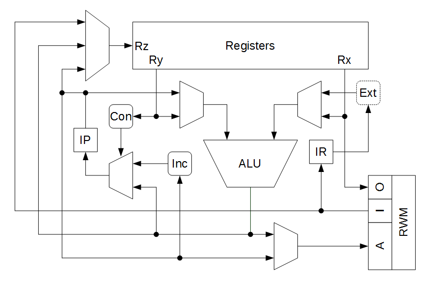

# Limen

> Simple 16-bit RISC processor.

Limen is a processor initiated in 2015 and it was later used withing [my high school thesis](https://github.com/dominiksalvet/high-school-thesis). It uses 16-bit RISC core architecture with von Neumann memory architecture. It was written in VHDL (with tab size 3!) and tested on an FPGA (Digilent Basys 2). Significant characteristics:

* Smallest addressable unit is 2 bytes
* May address up to 128 KB of memory
* 8 x 16-bit general purpose registers (R0 is always 0)
* No status register for arithmetic operations
* Defines 8 instruction formats

The microarchitecture itself is rather simple and straightforward – no pipelining involved. Feel free to look around the source code!

> Did you know that [Limen Alpha](https://github.com/dominiksalvet/limen_alpha) is its dual-core successor?

## Useful Resources

* [support.md](support.md) – questions, answers, help
* [contributing.md](contributing.md) – how to get involve
* [license](license) – author and license
